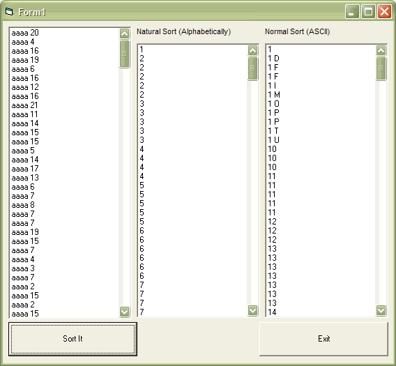



## Natural Sorting \(like in WinXP's Explorer\)

### Description

When strings are normally sorted, strings are compared by their ASCII values. This results in 10 being sorted before 2 (eg: 1 10 2 3 4 5 6 7 8 9).

This function tries to correct that.
 
### More Info
 

             |
---                |---
**Submitted On**   |2008-07-24 23:00:02
**By**             |[AlanMN](https://github.com/Planet-Source-Code/PSCIndex/blob/master/ByAuthor/alanmn.md)
**Level**          |Beginner
**User Rating**    |5.0 (15 globes from 3 users)
**Compatibility**  |VB 6\.0
**Category**       |[VB function enhancement](https://github.com/Planet-Source-Code/PSCIndex/blob/master/ByCategory/vb-function-enhancement__1-25.md)
**World**          |[Visual Basic](https://github.com/Planet-Source-Code/PSCIndex/blob/master/ByWorld/visual-basic.md)
**Archive File**   |[Natural\_So2121717242008\.zip](https://github.com/Planet-Source-Code/alanmn-natural-sorting-like-in-winxp-s-explorer__1-70878/archive/master.zip)

